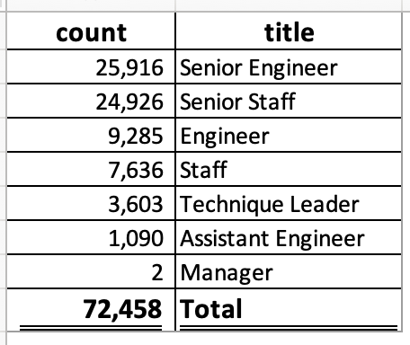

# Pewlett-Hackard-Analysis

## Overview of the analysis

Pewlett-Hackard is about to experience a large-scale retirement. To better understand the impacts of the upcoming retirements and how to appropriately plan for hiring new staff, Management has requested an analysis to determine:

 1. the number of employees retiring by title and

 2. The employees who are eligible to participate in a mentorship program. 

Note, the mentoring program will be structured to allow eligible retirees born in 1965 (between Jan 1 and December 31), to step into a part-time role to train newly hired staff.

A series of sql queries and tables were generated off of existing HR csv files to help answer these questions. 
 
## Results

   [Link to retirees by title csv file] (Data/retiring_titles.csv)
   
   [Link to employees eligible for the mentorship program csv file] (Data/mentorship_eligibilty.csv)

Based on the data analysis performed, the following highlights are noted:

1. There are 72,458 employees eligible for retirement. The breakdown by title is as follows:

   
    
2. The Senior Engineer and Senior Staff titles make up the largest percentage of eligible retirees (approximately 70% combined). Management should consider placing the biggest focus on this population through a combination of hiring and employee retention, where possible.

3. There are 1,549 employees eligible for the mentorship program. 

   ![Number of employees eligible for mentorship][Data/Employees eligible for mentorship program.png]

4. Of the 1,549 eligible for the mentorship program, statistics on two largest retiree groups noted in item 2 above are as follows:

   - Senior Staff make up the largest group eligible for the mentorship program , 417 employees (appropriately 27%).
   
   - Senior Engineers have 298 employees (approximately 19%) eligible for the mentorship program. 

## Summary

Utilizing the results above, two additional queries were generated to address the following questions:
 
Links to additional tables and queries run:

[Link to csv file generated to show all current employees, regardless of retirement eligibiity] (Data/current_empl_title_Dept.csv)

[Link to summary by title of all current employees] (Data/current_empl_title_Dept.csv)

[Link to table showing percentage of retirees to total current employee population] (Data/Retiring_employees_as_percent_total_cur_employees.png)

1. How many roles will need to be filled as the "silver tsunami" begins to make an impact?

If all employees eligible for retirement choose to retire, there will be 72,458 positions coming available. Management will need to determine how many of these positions need to be filled and if any positions can be combined or eliminated. With the exception of the Manager position, which is anticipated to only have 2 retirements, all remaining positions are estimated to have close to 30% of current employees retire. 

2. Are there enough qualified, retirement-ready employees in the departments to mentor the next generation of Pewlett Hackard employees?

When comparing the counts of employees eligible for mentorship against the counts of potential open positions, there is a significant disparity in the ratios. This leads to an indication that there will not be enough qualified retirees to mentor new hires. Management will want to be proactive in the hiring process to ensure the company will maintain sufficient coverage in staff and work.

[Link to ratio of open positions to retirees eligible mentorship] (https://github.com/RebeccaA79/Pewlett-Hackard-Analysis/blob/1486266b8376ba1d4ae67c9d8e8d0c701bd0c01d/Data/Ratio_Open_Positions_to_Eligiible_Mentors.png)

